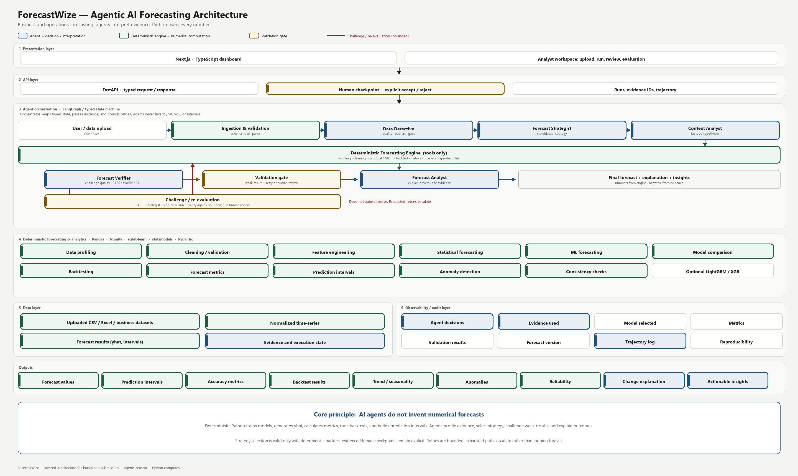
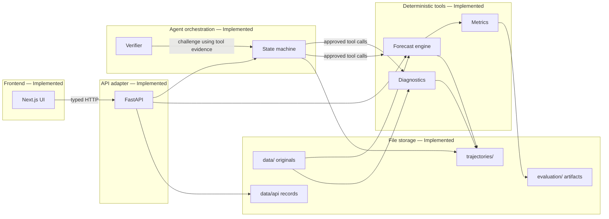
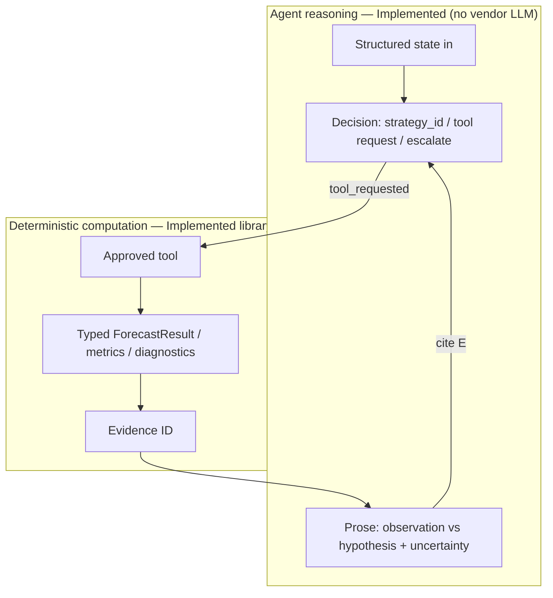
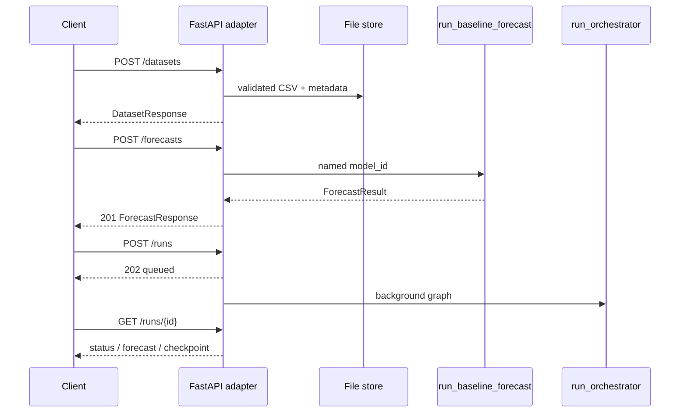
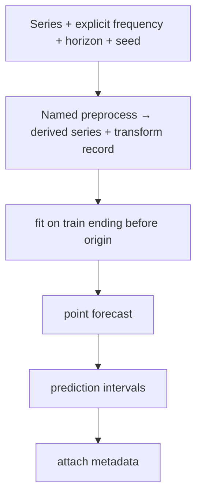
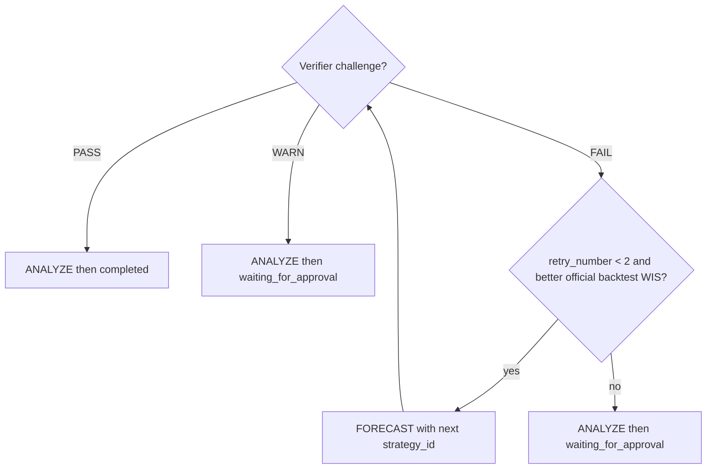
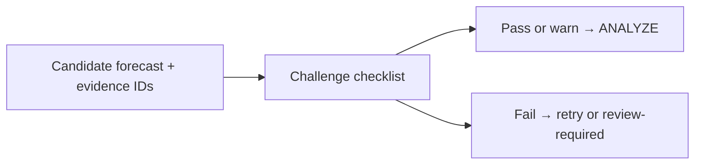
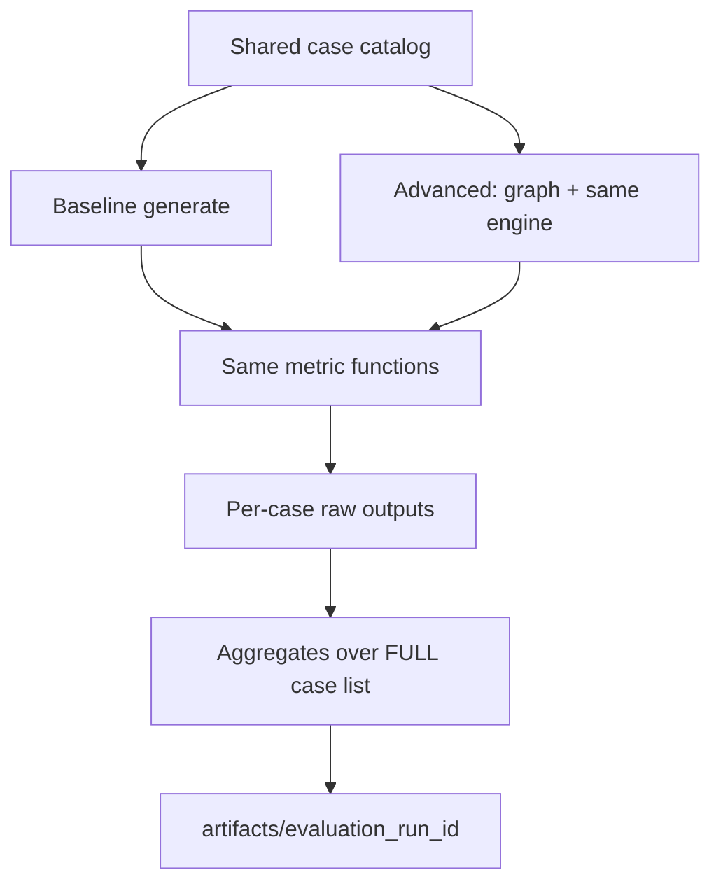

# Architecture

ForecastWize is an agentic **decision-support** system: the HTTP/UI layer talks to
an explicit agent state machine, which may only **request** deterministic tools.
Those tools own every numerical forecast, interval, and metric.

This document is the **intended** architecture. Components that exist in the repo
are labeled **Implemented**. Everything else is **Planned**. Do not treat a
diagram as a running subsystem.

**Hackathon architecture diagram** (agents vs deterministic engine, validation gate,
challenge loop):



Regenerate with `python scripts/render_architecture_diagram.py` (requires Pillow).

Related: [product-requirements.md](product-requirements.md),
[agent-design.md](agent-design.md),
[forecasting-methodology.md](forecasting-methodology.md),
[evaluation.md](evaluation.md).

---

## Status vs the repository

| Layer | Status |
|---|---|
| Frontend analyst journey | **Implemented** (`frontend/`; metrics from API only) |
| FastAPI adapter, config, structured logging, request IDs | **Implemented** (`/health` plus datasets, forecasts, runs, evaluations) |
| Directory placeholders `data/`, `evaluation/`, `experiments/`, `trajectories/` | **Implemented** (eval CSVs; named `experiments/EXP-*.md`) |
| Evaluation harness and case catalog | Catalog + baseline + agent harness + comparison **Implemented** |
| Production database | **Not used** |
| Authentication | **Not started** |
| Services (explicit baseline forecast; upload/eval trigger) | **Implemented** (`forecast_service` + HTTP adapters; auth **Not started**) |
| Deterministic forecasting engine | **Implemented** (four baselines; named-model HTTP via `POST /forecasts`) |
| Data diagnostics (CSV profile / validate / frequency) | **Implemented** (`backend/app/data/`; HTTP upload via `POST /datasets`) |
| Agent orchestration, tools, verifier | **Implemented** (graph in `orchestrator.py`; HTTP `POST /runs` background) |
| Evidence / trajectory writer | **Implemented** (`app/evidence`; JSONL + artifacts under `trajectories/`) |

**Implemented request today:** browser journey uses `/datasets`, `/runs`,
`/evaluations`, and `/health`. REST adapters store records under `data/api/`.
CLI evaluation harnesses remain the official WIS record.

---

## Intended system



Dependency direction (never reverse the arrows into forecasting):

```text
frontend → API adapters → agent graph → forecasting / diagnostics / metrics
                              ↑                    ↑
                         evaluation harness ── invokes metrics on shared cases
```

Forecasting, diagnostics, metrics, and evaluation **must not** import FastAPI,
Starlette, Next.js, or LLM clients. HTTP adapters **must not** contain forecast
math or prompts.

---

## Boundary: LLM reasoning vs deterministic numerics

This is the non-negotiable split.

| | LLM / agents | Deterministic Python |
|---|---|---|
| Status | Vendor LLM **not integrated**. Graph agents are **Implemented** as deterministic Python over structured state (no live prompts). | **Implemented** for fit/predict/metrics/backtests |
| May | Interpret deterministic diagnostics; propose candidate model families; explain selection; reason about evidence; participate in the workflow; recommend retry or human review | Backtest; calculate WIS and secondaries; calculate stability statistics; apply the instability veto; rank surviving models; produce numerical forecasts and intervals; verify numerical outputs |
| Must not | Emit official yhat, intervals, or metrics; claim a model ran without a tool result; invent dataset facts; silently edit series | Call LLMs, import the agent graph, or decide “best model” without a backtest artifact |



The LLM / agent must **not** be described as generating the numerical
forecast. It may **repeat** a number only by citing the evidence ID returned
by a tool. It may not recompute, “improve,” or fill missing metrics from
memory. Official advanced ranking is official backtest WIS among models that
pass the deterministic EXP-010 veto. Holdout values are never used for
selection.

---

## Layers

### Frontend — **Implemented** (analyst journey)

Next.js App Router, strict TypeScript. Presentation is separate from HTTP
(`src/lib/api.ts`). The browser displays API values; it does not compute
authoritative WIS or other official metrics.

**Implemented screens:** dashboard; CSV upload; dataset diagnostics (row count,
date range, frequency, missing periods, anomalies, seasonality, structural
break); forecast configuration; agent execution pipeline; forecast chart
(history, yhat, interval from the API); verification checks; model comparison
(official backtest WIS rows); evaluation dashboard at `/evaluation` via
`GET /evaluations/dashboard` (committed comparison JSON); optional live catalog
run via `POST /evaluations/compare`.
Loading, empty, error, and warning states are distinct (`role="alert"` for
errors, `role="status"` for warnings). Human checkpoints use labeled Accept /
Reject / Review controls (`POST /runs/{id}/checkpoint`). The UI does not
auto-approve.

### API — **Implemented**

FastAPI validates with Pydantic (`extra=forbid` on public models), CORS
allowlist, structured JSON logs, `X-Request-ID`, public vs internal errors (no
stack traces in production bodies). Handlers are adapters: parse → call domain
or graph functions → return typed models.

| Method | Path | Behavior |
|---|---|---|
| GET | `/health` | Liveness |
| POST | `/datasets` | Validate CSV (JSON or multipart); store under `data/api/` |
| GET | `/datasets/{id}` | Metadata, diagnostic summaries, and series points for charts |
| POST | `/forecasts` | Named baseline `model_id` via `run_baseline_forecast` (sync) |
| GET | `/forecasts/{id}` | Persisted `ForecastResult` |
| POST | `/runs` | Queue `run_orchestrator` (202; background) |
| GET | `/runs/{id}` | Run status, checkpoint, forecast, candidates, verification |
| POST | `/runs/{id}/checkpoint` | Accept, Reject, or Review. Appends a human trajectory step. Does not modify source CSV |
| GET | `/runs/{id}/trajectory` | JSONL steps |
| POST | `/evaluations/run` | Queue shared catalog harness (202; writes isolated result files) |
| GET | `/evaluations/{id}` | Status and official aggregates copied from the artifact |
| POST | `/evaluations/compare` | `compare_evaluations` on two completed artifacts |
| GET | `/evaluations/dashboard` | Committed `evaluation/results/comparison.json` plus catalog labels |
| GET | `/evaluations/changelog` | `docs/changelog.md` for the experiment log view |

No authentication. Agent and evaluation work do not run inside the request
handler. HTTP evaluation does **not** overwrite `evaluation/results/baseline.json`.

### Services — **Implemented** (named forecast; no selection)

`backend/app/services/forecast_service.py` runs one explicitly named baseline
(`model_id` in `naive` / `seasonal_naive` / `ets` / `arima`). It does not select a
model, call an LLM, or write evaluation scores. `POST /forecasts` calls this
service. `POST /runs` starts the orchestrator in a background task.

### Deterministic forecasting engine — **Implemented** (library)

Naive, seasonal naive, ETS, and fixed-order ARIMA/SARIMA implement `ForecastModel`.
Rolling-origin backtesting (`run_rolling_origin_backtest`) uses time-aware splits
only. **Selection** of a production `strategy_id` is **Implemented** in the
orchestrator from official backtest WIS; generation is a separate
`run_baseline_forecast` call. The backtester may **rank** models as evidence and
does not emit a winner forecast. Callers pass `model_id` or factories. Same data
+ config + seed → same numbers. Metadata on every `ForecastResult`: model,
training range, horizon, frequency, configuration, seed, `generated_at`
(UTC ISO 8601). Originals in `data/` are never overwritten.

### Data diagnostics — **Implemented** (CSV foundation) / **Planned** (model-oriented)

**Implemented:** load CSV; validate columns/timestamps/values/duplicates; sort a
derived copy; infer frequency; detect missing periods; descriptive statistics;
structured issues. HTTP `GET /datasets/{id}` also returns anomaly, seasonality,
and structural-break summaries from the same data tools. Original frames are
not mutated. HTTP upload is `POST /datasets`.

**Planned:** additional named transform records for repair policies beyond
eval-harness `linear_interpolate_train` and inspection.

### Agent orchestration — **Implemented** (library + HTTP runs)

**Implemented:** explicit typed state machine in
`backend/app/agents/orchestrator.py`. Nodes: START → PROFILE → DIAGNOSE →
CONTEXT → STRATEGY → BACKTEST → FORECAST → VERIFY → RETRY_OR_ACCEPT →
ANALYZE → FINALIZE. Child agents remain separate pipelines; the orchestrator
calls them. Max retries = 2. Verification is required before accept.
FAIL retries an alternative strategy **only** when that model has strictly
better official backtest WIS (EXP-007). Exhaustion or a worse remaining model
sets `waiting_for_approval` (never auto-approved). WARN and other checkpoint
triggers also wait. BACKTEST executes the caller allow-list, not the strategy
shortlist (EXP-008). `POST /runs/{id}/checkpoint` records the human decision.
Automated catalog evaluation opens checkpoints but does not call that
endpoint. Interactive Accept / Reject / Review is documented in
[human-in-the-loop-demo.md](human-in-the-loop-demo.md).
`POST /runs` queues this graph;
the handler returns 202. None of these agents emit a new yhat. Production
numbers come from `run_baseline_forecast` after backtest selection.

### Tools — **Implemented** (allowlisted names)

**Implemented:** `backtest` (`backend/app/tools/backtest_tools.py`) — allowlisted
name and baseline `model_id`s; typed `BacktestComparison`; unknown names/ids
rejected. Numerical work is `run_rolling_origin_backtest` (same function baseline
code should call).

**Implemented:** data diagnostic tools (`backend/app/tools/data_tools.py`) wrapping
`app.data` screens. No yhat. No in-place series edits. Unknown names rejected.

**Implemented:** `evaluate_candidates` / `list_supported_models`
(`backend/app/tools/forecasting_tools.py`) wrapping the same backtest engine.
Unsupported model ids are rejected. No production yhat in the compact payload.

**Implemented:** `inspect_context` (`backend/app/tools/context_tools.py`) records
optional event/context labels as provided. Unknown tool names are rejected. No
yhat. No causal inference.

**Implemented:** `verify_forecast` (`backend/app/tools/verification_tools.py`)
runs deterministic PASS/WARN/FAIL checks on a forecast artifact. Unknown names
are rejected. No yhat is produced. Interpretation overrides require a reason.

**Implemented (graph):** after official backtest ranking, the orchestrator
calls `run_baseline_forecast` with the selected `strategy_id`. Allowlisted
tools are the existing named tools; unknown names remain rejected. HTTP does
not accept arbitrary tool names.

### Verification — **Implemented** (deterministic + graph)

**Implemented:** deterministic `verify_forecast` + Verifier agent. Checks
falsify bounds, range, trend/season mismatch, residuals, coverage, interval
width, regime-change risk, extreme growth, and invalid values. Quiet-accept of a
FAIL without a recorded override is rejected by schema.

**Implemented (graph):** VERIFY runs after every FORECAST. FAIL does not
quiet-accept. Retry or human escalation is in RETRY_OR_ACCEPT.

**Planned:** leakage challenge beyond artifact checks.

### Evidence / trajectory — **Implemented**

Append-only JSONL under `trajectories/` via `backend/app/evidence/`. Tool
payloads are stored as artifacts and referenced (`tool_output_ref`); the JSONL
line keeps a hash of a redacted `input_summary` (no raw series, no secrets).
Retries add rows; they do not rewrite history. Official catalog evaluation
persists one JSONL per case under `evaluation/results/trajectories/`; child
agents append to that same file. See
[trajectory-evidence.md](trajectory-evidence.md).

### Evaluation framework — **Implemented**

Shared case catalog (≥12, including adversarial). Baseline and advanced receive
the **same** cases. Primary metric **WIS**; secondaries per
[evaluation.md](evaluation.md). Executable scripts; `evaluation/results/*.json`
identified by `evaluation_run_id`; failed cases stay in official aggregates.
Evaluation invokes forecasting metric functions; it does not fork formulas or
import FastAPI/Next.

---

## Request lifecycle

**Implemented path**



The UI polls `GET /runs/{id}` and `GET /evaluations/{id}`. Explicit human
Accept / Reject / Review is `POST /runs/{id}/checkpoint`. The UI does not
auto-approve.

---

## Forecast lifecycle

**Implemented (library + HTTP):** `run_baseline_forecast` and `run_rolling_origin_backtest`
skip the graph and call the engine. `POST /forecasts` uses the named-model path.
The orchestrator uses the same engine after backtest selection (`POST /runs`).



No shuffle for ordinary evaluation. No future features/imputation. Model choice
requires a backtest evidence artifact — not an LLM preference.

---

## Agent state

**Implemented** on orchestrator/trajectory and displayed on the agent-run screen:

`idle` → `running` → (`retrying` | `waiting_for_approval`) → `completed` | `failed`

State is the typed graph snapshot plus last trajectory `final_status`.

---

## Retry flow

**Implemented** in `run_orchestrator`. Documented finite cap (`ORCHESTRATOR_MAX_RETRIES = 2`).
Each retry increments `retry_number` and appends a trajectory step.



Exhaustion does not loop. Prior decisions remain in the log. The graph never
auto-approves a checkpoint.

---

## Verification flow

**Implemented** as the VERIFY node. PASS/WARN continue; FAIL retries or
escalates. A verifier that only restates metrics is non-compliant. See
[agent-design.md](agent-design.md).



---

## Evidence flow

**Implemented** in agent/orchestrator trajectories. The forecast screen lists
evidence IDs and risks copied from the run payload.

1. Tool returns a typed payload; store assigns `evidence_id` and may write an
   artifact referenced by `tool_output_ref`.
2. Trajectory step lists instruction, hashed input summary, tool invocation,
   compact `tool_result` pointer, `decision`, `evidence_ids`, `next_step`, and
   `error` when the step failed.
3. Agent material claims cite those IDs (observations). Other text is hypothesis.
4. API/UI display numbers from tool payloads, not from LLM prose (**Implemented**).
5. Evaluation artifacts may reference the same IDs; they do not replace WIS scripts.

Missing evidence ⇒ cannot claim “model executed” or a metric value.

---

## Evaluation flow

**Baseline and agent harnesses Implemented.** Official improvement is the WIS
`relative_improvement` in `evaluation/results/comparison.json` for a paired run.
Cited official pair: `comparison-20260830T030644Z`, value
**0.13264925035654543** (~13.26%). This document does not invent a
different percentage.



Comparison is valid only when `case_list`, metric code, and splits match.
Official improvement is executable WIS on that full list. The cited pair is
a measured win (`relative_improvement` 0.1326). The advanced path does not
win every case (8 / 2 / 2).

---

## Storage

Prefer files. **No production database** unless a later requirement is
demonstrated.

| Path | Role |
|---|---|
| `data/` | Original series; never overwrite. Generated eval CSVs in `data/evaluation/`. API records in `data/api/` (gitignored) |
| `trajectories/` | Append-only JSONL + referenced artifacts **Implemented** (`app/evidence`) |
| `evaluation/` | Catalog + `results/baseline.json`, `agent.json`, `comparison.json` **Implemented** |
| `experiments/` | Named EXP records; measured claims via `evaluation/results/` and `evaluation/artifacts/EXP-*/` (**Implemented**) |
| Docker Compose | **Implemented**: host ports `127.0.0.1:8000` / `127.0.0.1:3000`; `APP_ENV=production`; backend non-root `appuser`; frontend `USER node`; catalog CSVs, `evaluation/results/`, `docs/changelog.md` in the backend image; volume `api-store` |

---

## Major decisions

### D1 — Layout uses `backend/` and `frontend/`

- **Context:** Standards suggested `api/` and `web/`. Bootstrap required these names.
- **Choice:** HTTP in `backend/app/`; UI in `frontend/`.
- **Rejected:** Empty alias packages with no callers.
- **Consequence:** Forecasting still must not live in route handlers.

### D2 — No production database in the skeleton

- **Context:** Simple reproducible storage.
- **Choice:** Directories and files only.
- **Rejected:** Postgres/SQLite “for later.”
- **Consequence:** Revisit only with a demonstrated need.

### D3 — LLM key is optional at boot

- **Context:** Fail-fast on required config; no vendor LLM is wired.
- **Choice:** `OPENAI_API_KEY` may be empty; `/health` reports `llm_configured`.
- **Rejected:** Requiring a vendor key before an LLM client exists.
- **Consequence:** The orchestrator runs without a key. A real LLM client would
  make the key required.

### D4 — Explicit state machine for agents (**Implemented**)

- **Context:** Hidden control flow makes retries and evidence un-auditable.
- **Choice:** Explicit typed Python state machine (equivalent to a graph library,
  no extra dependency); few agents; verifier as a required graph step; max
  retries = 2.
- **Rejected:** A single chat loop that both “thinks” and invents numbers;
  adding a graph library before a demonstrated need.
- **Consequence:** Tools stay Python; the graph never becomes the metric library.
  `POST /runs` is the HTTP entry. Human Accept / Reject / Review is
  `POST /runs/{id}/checkpoint`. The graph never auto-approves.

### D5 — Evaluation harness fill is named and train-only (EXP-006)

- **Context:** Case 005 non-finite train values null official WIS if failed cases stay in the mean.
- **Choice:** `linear_interpolate_train` after `split_train_holdout` on both harnesses; source CSV and holdout untouched; fitters still reject leftover NaN.
- **Rejected:** Silent fill inside `copy_training`; dropping 005 from the official mean.
- **Consequence:** Official WIS became non-null (`evaluation/artifacts/EXP-006-missing-policy/`).

### D6 — Retry and candidate set follow backtest evidence (EXP-007, EXP-008)

- **Context:** Case 003 swapped to worse `naive` on VERIFY FAIL; 009/010 backtested only a hypothesis shortlist.
- **Choice:** Retry only if official backtest WIS strictly improves; execute `BASELINE_MODEL_IDS` (or the caller allow-list) at BACKTEST.
- **Rejected:** Retry-to-next-id regardless of WIS; treating `propose_candidate_ids` as the executed set.
- **Consequence (historical EXP-008 / pre-EXP-010):** That pair had WIS
  parity (`comparison-20260829T125254Z`). It is archived at
  `evaluation/artifacts/pre-exp010-promotion/` and is **not** the current
  official result. Current official is **EXP-010** (D8): official WIS
  `relative_improvement` **0.13264925035654543**. Human WARN checkpoints
  remain on the official pair (12 opened, 0 human decisions).

### D7 — Agent-only model-specific backtest origins (EXP-009)

- **Context:** Shared expanding origins of length ~8 made seasonal ETS/ARIMA
  fail fold 0, so they could never receive official backtest WIS.
- **Choice:** Advanced `evaluate_candidates` *may* use
  `run_model_specific_origin_backtest` when callers pass
  `origin_planning='model_specific'`. Baseline keeps
  `run_rolling_origin_backtest`. Models declare `minimum_train_size`.
  After the isolated run failed WIS, the planner was **not** left as the
  default. It remains a historical opt-in.
- **Rejected:** Ranking on `wis_completed_only`; changing WIS; copying the
  planner into the baseline; using holdout for selection; treating EXP-009
  as a catalog success.
- **Consequence:** Isolated pair
  `evaluation/artifacts/EXP-009-ets-arima-min-train/` (`comparison-20260829T154706Z`):
  agent official WIS **worse** (`relative_improvement` −1.662), mainly case
  **012**. Do not describe EXP-009 as successful. Reproduce with
  `python evaluation/run_agent.py --origin-planning model_specific`
  (CLI treats a bare `model_specific` flag as historical EXP-009:
  planner only, no veto). Explicit form:
  `--origin-planning model_specific --selection-policy default`.

### D8 — EXP-010 last/earlier fold-WIS veto (official advanced path)

- **Context:** EXP-009 made ETS/ARIMA eligible but 012 last-fold WIS exploded
  (ratio ≈17) while official mean still picked ETS.
- **Choice:** Official advanced `selection_policy='exp010'` adds
  `analyze_backtest_robustness` and vetoes models with last/earlier ≥ 5
  (frozen from EXP-009 train folds before the EXP-010 run). Rank remaining
  by official WIS. Retry skips vetoed models. Baseline stays shared-origin
  `run_rolling_origin_backtest`. `R` is not retuned.
- **Rejected:** Weighted blend; last-fold-only ranking (would pick ETS on
  007); “if break then seasonal naive”; retuning `R` after the catalog run;
  copying the gate into the baseline; starting EXP-011 in the same change.
- **Consequence:** Isolated pair
  `evaluation/artifacts/EXP-010-robust-model-selection/`
  (`comparison-20260830T014245Z`) matched the promoted official pair
  `evaluation/results/comparison.json` (`comparison-20260830T030644Z`):
  official WIS **0.79391** vs baseline **0.91533**,
  `relative_improvement` **0.1326**. Case 012 still loses holdout WIS.
